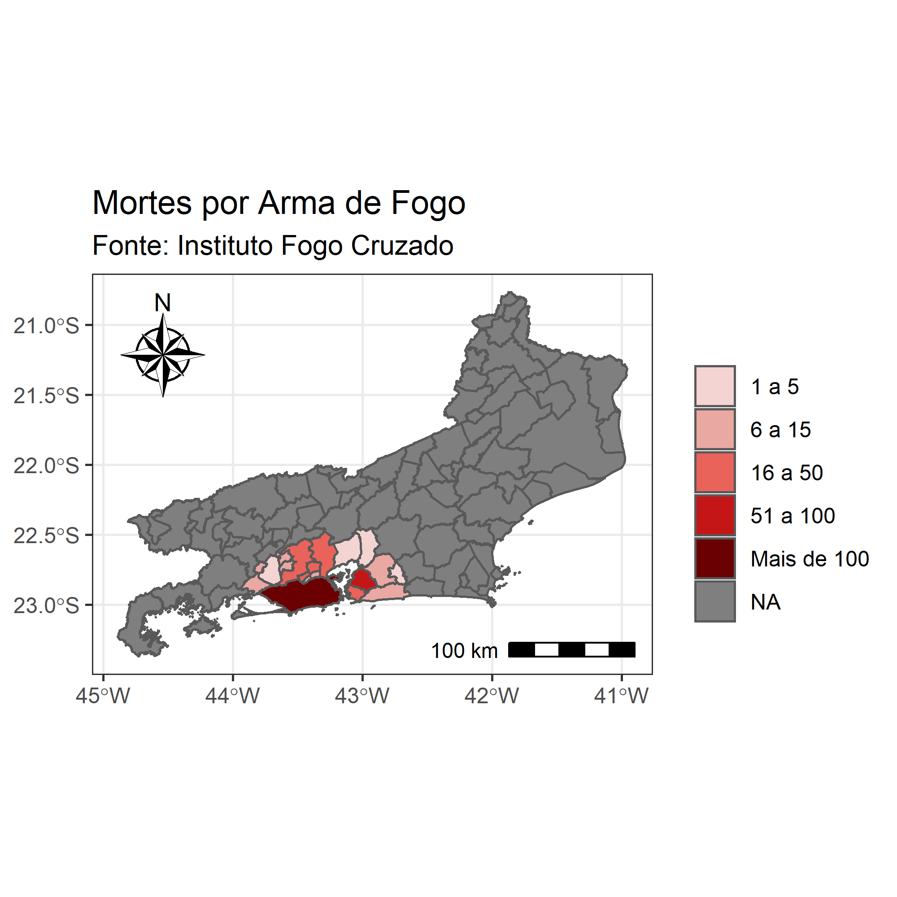

# Fogo_Cruzado_RJ

O Instituto Fogo Cruzado cataloga ocorrências de tiroteios em algumas cidades brasileiras, fazendo geolocalização,
informando a rua onde o evento ocorreu. Com estas características, fica fácil perceber o quão rico é esta base de dados, e as oportunidades de pesquisa que esses dados permitirão no futuro.

## Objetivo

A ideia do projeto é coletar os dados contidos no Instituto Fogo Cruzado, que cataloga alguns dados
de criminalidade em algumas cidades no Brasil. O foco, a princípio, será o Estado do Rio de Janeiro, 
mais especificamente a região metropolitana do Estado fluminense. Os primeiros dados compilados são 
de mortes acumuladas por municípios. 

## Pacotes Utilizados

Os seguintes pacotes foram utilizados:

* `crossfire`(Coleta de dados);
* `ggplot2`(Visualização de dados);
* `sf`(Visualização de dados);
* `tidyverse`(Manipulação de dados);
* `geobr`(Coleta de dados);
* `ggspatial`(Visualização de dados);
* `ggimage`(Visualização de dados);
* `ggthemes`(Visualização de dados);
* `dplyr`(Manipulação de dados)

## Visualização de dados

Este é um gráfico preliminar. Os dados não foram normalizados. Portanto, o gráfico não explica muita coisa, apenas mostra que há mais mortes em regiões mais populosas, tais como os municípios de Rio de Janeiro e São Gonçalo.

